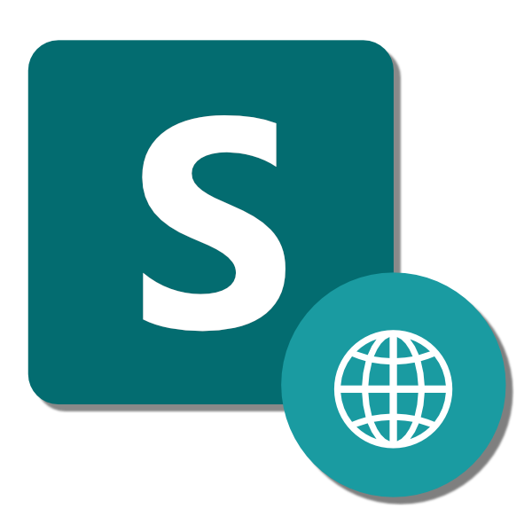

# SharePoint HTTP Connector Core

```SharePoint http connector core``` is a library developed in ```.NET C#``` that can help us manage API calls to our sites on SharePoint. The library provides a list of features that are useful for this integration.



## Overview

```SharePoint http connector core``` is an Open-Source project, remember that you can support it if you want.

During the documentation you will see that the implementation of this library is pretty simple but it useful when you need to apply a custom integration with a SharePoint site.

Some of the functions that you will see are:
- Get file information.
- Upload a new file.
- Create new folder.
- Get files information from directory.
- And much more.

Before to start, remember that there is some information that is very important to have to use the library. You will need to generate an ```App Information``` inside your SharePoint site.

## Documentation

You can implement this library in different project types, one of these is an ```ASP.NET Core``` project. Let's see how can we do that.

### Implementation

Implement this library is pretty simple, you only need to import the ```Service Extensions``` class to use the function ```UseSharePointSite``` for you ```IServiceCollection``` instance.

Do not forget that you will need configure your own ```App Information``` inside your ```appsettings.json``` file.

```
"SharePointSite": {
    "id": "00000000-0000-0000-0000-000000000000",
    "name": "Contoso site",
    "tenantId": "00000000-0000-0000-0000-000000000000",
    "clientId": "00000000-0000-0000-0000-000000000000@00000000-0000-0000-0000-000000000000",
    "clientSecret": "Your Client Secret",
    "sharePointSiteURL": "https://contoso.sharepoint.com/sites/contoso-site/"
}
```
Site ```name``` and ```id``` are two params that are optional to configure.

Once your have done this step, you will need to implement the ```UseSharePointSite``` method.

```
// Add configuration of authentication with microsoft.
builder.Services.UseSharePointSite(builder.configuration.GetSection("SharePointSite"));
```

This extension method accept both ```IConfigurationSection``` and an instance of ```SPContextConfiguration``` class.

### Configure your own App Information

You can access to an URL like the following:
```https://contoso.sharepoint.com/sites/contoso-site/_layouts/15/appregnew.aspx``` to configure a new ```App Information```. 

Also, you will need to configure the permissions to this new ```App Information``` that you created. To do that, you can access to an URL like this: ```https://contoso.sharepoint.com/sites/contoso-site/_layouts/15/appinv.aspx```.

The following video can help you to configure it ```https://www.youtube.com/watch?v=uHwQzeyDc1A```.

### Use of the service

The use of this library using ```Dependency Injection``` is very easy, you only need to request ```ISharePointContext``` service.

```
public class ExampleController : ControllerBase
{
    private readonly ISharePointContext _context;

    public ExampleController(ISharePointContext context) 
        => _context = context;
}
```

The following are some examples about the use of this library.

```
// This method can be used to download a file content.
var response = await _context.GetFileContentAsync(relativeURL, resourceName);

// This method can be used to get a file information.
var response = await _context.GetFileAsync(relativeURL, resourceName);
```

You will see that the most of the times some methods will requires a ```relativeURL```. This param is the relative path (or location) that you resource in SharePoint has.

This relative URL is defined from the document library to the location of your file or folder.

```
// This method can be used to download a file content.
var response = await _context.GetFileContentAsync("Shared Documents", "Document.pdf");

// This method can be used to get a file information.
var response = await _context.GetFileAsync("Shared Documents", "Document.pdf");
```

There are many methods to interact with SharePoint inside this library.

```SharePoint http connector core``` is an Open-Source project, remember that you can support it if you want.

## Repository

- [SharePoint.Http.Connector.Core](https://github.com/emmanuel-toledo/sharepoint-connector-core)

## Authors

- [@emmanueltoledo](https://github.com/emmanuel-toledo)

